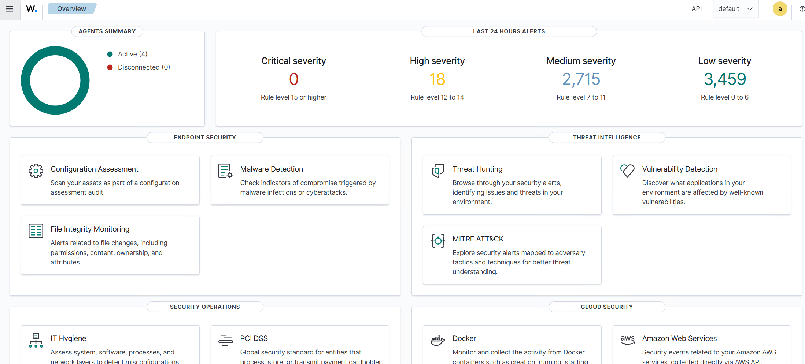
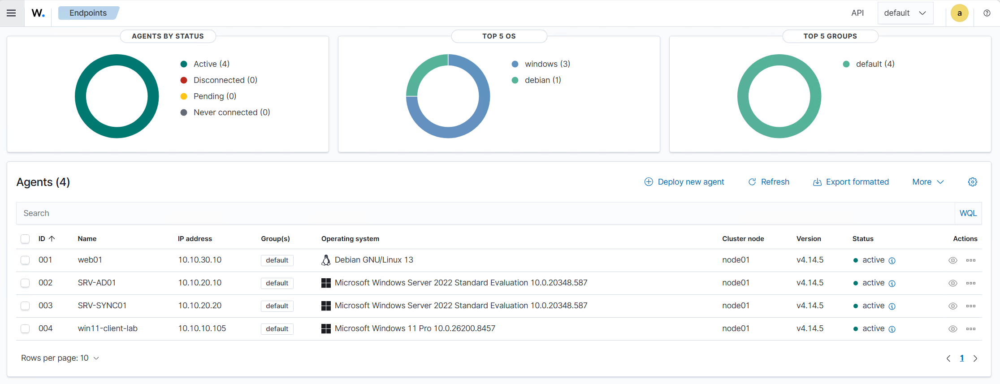
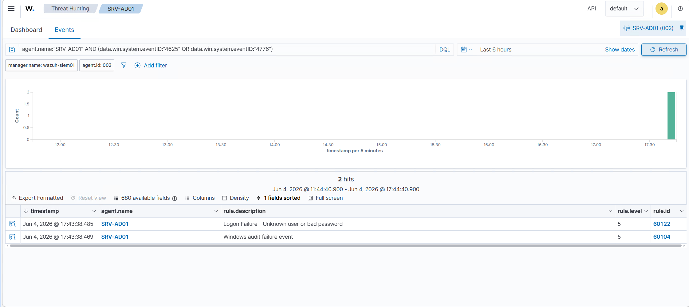
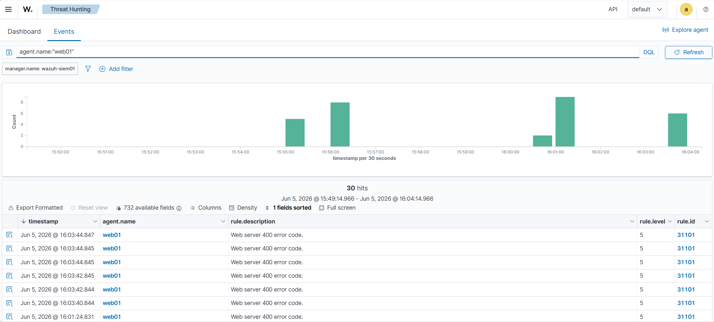

# Wazuh SIEM Homelab

A practical SIEM and centralized logging homelab built on Proxmox VE using Wazuh.

This project demonstrates how to deploy a dedicated Wazuh server and centralize security events from Windows, Active Directory, Linux, and DMZ systems.

## Lab Overview

The lab is built on Proxmox VE and uses OPNsense to route traffic between segmented virtual networks.

Monitored systems:

- SRV-AD01: Windows Server 2022 domain controller with AD DS and DNS
- SRV-SYNC01: Windows Server 2022 used for Microsoft Entra Cloud Sync
- win11-client-lab: Windows 11 domain-joined client
- web01: Debian/Nginx web server in the DMZ
- wazuh-siem01: Dedicated Wazuh all-in-one SIEM server

## Goals

- Deploy a dedicated Wazuh SIEM server
- Install Wazuh agents on Windows and Linux systems
- Centralize Windows Security, System, and Application logs
- Collect Linux system logs and Nginx web server logs
- Detect failed Active Directory logon attempts
- Detect suspicious web requests against a DMZ web server
- Document firewall rules and network segmentation
- Build a portfolio-ready security monitoring project

## Architecture

Network zones:

| Zone | Subnet | Purpose |
|---|---|---|
| LAN | 10.10.10.0/24 | Windows 11 client network |
| SERVERS | 10.10.20.0/24 | AD, Cloud Sync, Wazuh |
| DMZ | 10.10.30.0/24 | Debian/Nginx web server |

Main systems:

| Hostname | IP address | Role |
|---|---|---|
| wazuh-siem01 | 10.10.20.50 | Wazuh all-in-one SIEM |
| SRV-AD01 | 10.10.20.10 | Active Directory Domain Controller / DNS |
| SRV-SYNC01 | 10.10.20.20 | Microsoft Entra Cloud Sync server |
| win11-client-lab | 10.10.10.105 | Windows 11 domain client |
| web01 | 10.10.30.10 | Debian/Nginx DMZ web server |

## Wazuh Deployment

Wazuh was deployed as an all-in-one installation on a dedicated Ubuntu Server VM.

VM specifications:

| Setting | Value |
|---|---|
| VM ID | 350 |
| Hostname | wazuh-siem01 |
| IP address | 10.10.20.50 |
| CPU | 4 cores |
| RAM | 8 GB |
| Disk | 100 GB |
| Network | SERVERS / vmbr20 |
| Wazuh version | 4.14.5 |

## Agents

The following Wazuh agents were installed and validated:

| Agent | OS | IP address | Status |
|---|---|---|---|
| web01 | Debian GNU/Linux 13 | 10.10.30.10 | Active |
| SRV-AD01 | Windows Server 2022 | 10.10.20.10 | Active |
| SRV-SYNC01 | Windows Server 2022 | 10.10.20.20 | Active |
| win11-client-lab | Windows 11 Pro | 10.10.10.105 | Active |

## Detection Tests

### Active Directory failed logon detection

A failed authentication attempt was generated from the Windows 11 client against the domain controller.

Test command:

    net use \\10.10.20.10\IPC$ /user:HOMELAB\compte.inexistant MauvaisMotDePasse123!

Detected Windows event IDs:

| Event ID | Meaning |
|---|---|
| 4625 | Failed logon |
| 4776 | Credential validation failure |

Wazuh detected the event as:

| Rule ID | Description | Level |
|---|---|---|
| 60122 | Logon Failure - Unknown user or bad password | 5 |
| 60104 | Windows audit failure event | 5 |

### Nginx web request detection

Suspicious HTTP requests were generated against the Debian/Nginx DMZ server.

Example requests:

    http://web01.homelab.local/test404
    http://web01.homelab.local/.env
    http://web01.homelab.local/wp-login.php
    http://web01.homelab.local/etc/passwd

Nginx access logs were collected from:

    /var/log/nginx/web01_access.log

Wazuh detected the events as:

| Rule ID | Description | Level |
|---|---|---|
| 31101 | Web server 400 error code | 5 |

## Screenshots

### Wazuh overview dashboard

### Active Wazuh agents

### Active Directory failed logon detection

### Nginx web events detected

## Firewall Rules

Firewall rules were configured in OPNsense to allow only the required traffic between monitored systems and the Wazuh server.

Required Wazuh ports:

| Port | Protocol | Purpose |
|---|---|---|
| 1514 | TCP | Agent event forwarding |
| 1515 | TCP | Agent enrollment/authentication |
| 443 | TCP | Wazuh dashboard access |

Examples:

| Source | Destination | Ports | Purpose |
|---|---|---|---|
| SRV-AD01 | wazuh-siem01 | TCP 1514-1515 | Wazuh agent communication |
| SRV-SYNC01 | wazuh-siem01 | TCP 1514-1515 | Wazuh agent communication |
| win11-client-lab | wazuh-siem01 | TCP 1514-1515, 443 | Agent and dashboard access |
| web01 | wazuh-siem01 | TCP 1514-1515 | Linux agent communication |

## Maintenance Notes

During the project, the Proxmox host was also reviewed and cleaned up:

- Fixed inconsistent APT repositories after the Proxmox VE 9 upgrade
- Aligned Debian and Proxmox repositories to trixie
- Upgraded Proxmox VE to 9.2
- Fixed QEMU Guest Agent communication on Windows VMs using VirtIO guest tools
- Cleaned old intermediate snapshots
- Reduced LVM thinpool usage from around 50% to around 37%
- Confirmed disk I/O wait returned to 0%

## Lessons Learned

This project helped validate several practical administration and security skills:

- Deploying a SIEM in a segmented homelab
- Installing and validating Wazuh agents on Windows and Linux
- Collecting Windows security events from an Active Directory domain controller
- Enabling audit policies for failed logon detection
- Collecting custom Nginx access logs from a DMZ server
- Troubleshooting log collection paths
- Managing firewall rules between LAN, SERVERS, and DMZ networks
- Maintaining Proxmox repositories, snapshots, and VM guest tools

## DNS / Name Resolution

Internal DNS is provided by the Active Directory domain controller SRV-AD01.

The lab uses the internal domain:

    homelab.local

Important DNS records:

| Name | IP address | Purpose |
|---|---|---|
| SRV-AD01.homelab.local | 10.10.20.10 | Domain Controller / DNS |
| web01.homelab.local | 10.10.30.10 | DMZ Nginx web server |
| wazuh-siem01 | 10.10.20.50 | Wazuh SIEM server |

The Windows 11 domain client uses SRV-AD01 as DNS server.

This allows the client to resolve internal lab names such as:

    web01.homelab.local

During the detection tests, web requests were generated using both the DNS name and the IP address of web01.

## References

Official documentation used during this project:

- Wazuh documentation - Architecture and default ports: https://documentation.wazuh.com/current/getting-started/architecture.html
- Wazuh documentation - Agent enrollment requirements: https://documentation.wazuh.com/current/user-manual/agent/agent-enrollment/requirements.html
- Wazuh documentation - Agent enrollment troubleshooting: https://documentation.wazuh.com/current/user-manual/agent/agent-enrollment/troubleshooting.html
- Microsoft documentation - Event ID 4625, failed logon: https://learn.microsoft.com/en-us/previous-versions/windows/it-pro/windows-10/security/threat-protection/auditing/event-4625
- Microsoft documentation - Event ID 4776, credential validation: https://learn.microsoft.com/en-us/previous-versions/windows/it-pro/windows-10/security/threat-protection/auditing/event-4776
- Microsoft documentation - Advanced audit policy configuration: https://learn.microsoft.com/en-us/windows-server/identity/ad-ds/plan/security-best-practices/advanced-audit-policy-configuration
- Proxmox VE documentation - Package repositories: https://pve.proxmox.com/wiki/Package_Repositories

## Status

Project status: Completed and validated.

Core validation points:

- Wazuh dashboard accessible
- 4 agents active
- Active Directory failed logon detection working
- Nginx web event detection working
- Proxmox host stable after maintenance
